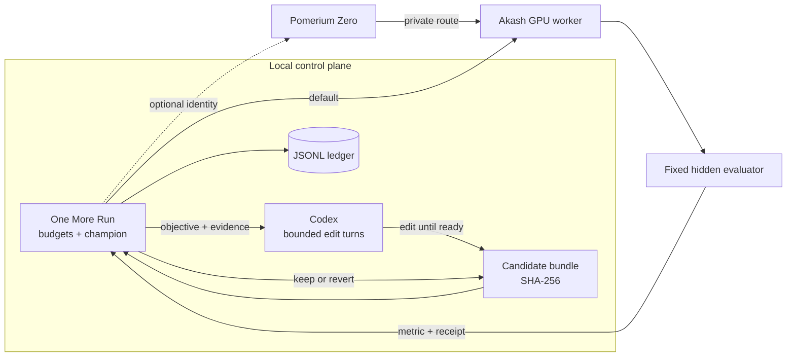

# One More Run

**Autoresearch on any compute.**

One More Run is a small control plane for bounded, autonomous ML research.
Codex rewrites a complete training program, an isolated Akash GPU worker
evaluates it against hidden fixed data, and One More Run keeps only measured
improvements.



The core does not know how a GPU is provisioned. An adapter emits a tiny JSONL
event protocol; the CLI enforces the run and time budgets, verifies that each
measurement matches its proposed candidate and evaluator, records durable
results, and renders the campaign.

## Run the code-evolution loop

Configure credentials without putting them in shell history or the repository:

```bash
uv sync
uv run omr setup
uv run omr doctor
```

`CODEX_API_KEY` is optional when the installed Codex CLI already has a saved
login. For unattended API-key operation, One More Run supplies the saved key
only to each bounded `codex exec` invocation. The Akash credential is used only
by the local deployment controller. Neither the Codex nor Akash credential
reaches the remote worker.

Then run one command:

```bash
uv run omr research research.md --yes
```

The first experiment measures the modular
[examples/code_candidate](examples/code_candidate) workspace. Before every
later experiment, bounded fresh Codex turns read the objective and measured
history, edit that workspace, and explicitly report when the candidate is ready
for expensive evaluation. The worker then evaluates the complete source bundle
against hidden deterministic data. Improvement advances the champion; a crash
or regression restores the previous bundle. The champion and history remain in
`.omr/autoresearch/`, while verified receipts remain in `experiments.jsonl`.

Codex may split modules and change feature construction, architecture, loss,
optimizer, schedule, and training algorithm. It cannot change the evaluator or
hidden validation targets.

## Three-minute demo

Run the campaign before recording so the demo does not depend on marketplace
startup time:

```bash
uv run omr research research.md \
  --max-runs 3 \
  --workspace .omr/demo \
  --ledger demo/experiments.jsonl \
  --yes
```

The checked-in [verified Akash campaign](demo/README.md) contains three real
GPU receipts and their complete source bundles. Its general neural candidate
reduced MSE from `0.854451` to `0.002781`, a 99.67% reduction. A later
source-informed exact-basis result is preserved and disclosed separately.

### Copy-paste presentation mode

Do not provision paid compute during the pitch. Paste this before speaking and
leave the verified ledger on screen while walking through the visual material:

```bash
uv run omr doctor && \
uv run pytest -q && \
uv run omr status demo/experiments.jsonl
```

This checks the configured Codex and Akash boundary, runs the full test suite,
and renders the real Akash receipts without network access or spend. To show a
fresh loop instead, run the same controller against the deterministic local
adapter:

```bash
DEMO_LEDGER="$(mktemp -d)/experiments.jsonl"
uv run omr run research.md \
  --max-runs 6 \
  --ledger "$DEMO_LEDGER" \
  -- uv run python examples/demo_adapter.py
```

The local path uses no credentials, network, or paid compute. The recorded
Akash deployment is intentionally closed; automatic cleanup is part of the
demo.

Suggested timing: 20 seconds for the problem and diagram, 30 seconds for the
modular candidate and readiness loop, 60 seconds for the real Akash ledger and
keep/revert decision, 30 seconds for credential and spend boundaries, and 40
seconds for the product close and one-command rerun.

## Try the numeric loop locally

Clone the submodule and run the deterministic adapter:

```bash
git clone --recurse-submodules https://github.com/drukpa1455/one-more-run.git
cd one-more-run
uv sync
uv run omr run research.md --plain -- uv run python examples/demo_adapter.py
uv run omr status experiments.jsonl
```

Remove `--plain` for the live terminal display. The demo adapter runs the same
adaptive coordinate search and fixed evaluator as the remote path, using a
deterministic CPU fallback when CUDA is unavailable. It exercises the real
propose, measure, observe, keep-or-reject loop without a deployment.

## Adapter protocol

Adapters write one JSON object per line to standard output and send human logs
to standard error:

```json
{"type":"campaign.started","provider":"akash"}
{"type":"experiment.started","run":1,"hypothesis":"baseline","candidate":{"learning_rate":0.02,"momentum":0.0,"steps":80},"evaluator":"smoke.linear-regression.v1"}
{"type":"experiment.progress","run":1,"metric":1.12}
{"type":"experiment.finished","run":1,"candidate_sha256":"12865576f004f19fb233e2b4abe1f35a491f63e4e55f39f5479408e772a195bb","evaluator":"smoke.linear-regression.v1","metric":1.04,"seconds":300,"cost_usd":0.17}
{"type":"campaign.finished"}
```

One More Run passes `OMR_RESEARCH`, `OMR_MAX_RUNS`, and `OMR_MAXIMIZE` to the
adapter. The CLI is the sole owner of the ledger. It normalizes and hashes the
candidate before the run, then requires the finished event to carry the same
hash and evaluator ID.
The ledger therefore preserves rejected candidates instead of retaining only a
score and description. The Akash adapter proposes one coordinate from the
current measured champion. An improvement advances the champion; a regression
reverses that coordinate before the search moves on. The authenticated evaluator
and workload stay fixed; only the bounded candidate crosses the boundary.

The `autoresearch` submodule is the reference workload. The included nonlinear
regression task is intentionally small enough for a hackathon demo; adapters for
that full workload and AcquaTerra can reuse the same edit/evaluate/keep contract.

## Run on Akash

The end user supplies credentials once through `omr setup`. The agent-driven CLI
owns the rest of the deployment lifecycle. The original numeric smoke path is:

```bash
uv run omr akash research.md --yes
```

By default, `omr akash` deposits `$0.50`, accepts only an open bid at or below
`1000 uact` per block, waits for a CUDA worker, runs three experiments, and
closes the deployment. Bidding, startup, and research share a ten-minute
deadline; cleanup gets one final bounded 30-second request. The CLI generates
the worker token locally and injects it only into the in-memory manifest, so no
one has to open provider logs. The Console key is not passed to the adapter or
remote worker. The deployment is closed in cleanup even when bidding, startup,
or research fails.

`--yes` is the explicit authorization boundary for the displayed deposit, bid,
and time limits. Keep `AKASH_API_KEY` in a secret manager, never commit it, and
rotate it after a temporary test. Console API keys grant full account access.
See the [Managed Wallet API documentation](https://akash.network/docs/api-documentation/console-api/getting-started/).

The worker supports both the original three-parameter smoke evaluator and the
code evaluator. Code experiments run one at a time in a child process with a
fixed hidden dataset, a hard timeout, a bounded source payload, and a scrubbed
environment that excludes controller credentials and the worker bearer token.
Every response binds the exact source hash to the evaluator identity. The SDL
accepts several trial-eligible NVIDIA models.

The worker image is published to GHCR from pinned GitHub Actions, and the Akash
SDL pins its immutable OCI digest.

### Optional Pomerium boundary

Pass `--pomerium` to put a Pomerium Zero service identity in front of the
worker. This selects `deploy/akash-pomerium.yaml`; the ordinary command and SDL
remain the smallest proven path.

Configure a Zero route from `https://worker.<cluster>.pomerium.app` to the
private `http://worker:8080` service, attach a service-account policy, and set:

```bash
export POMERIUM_ZERO_TOKEN=...
export POMERIUM_ZERO_API_TOKEN=...
export POMERIUM_ROUTE_URL=https://worker.<cluster>.pomerium.app
export POMERIUM_SERVICE_ACCOUNT_JWT=...
uv run omr doctor --pomerium
uv run omr research research.md --pomerium --yes
```

The controller validates the exact route, temporarily points the Zero cluster
at the leased Akash IP, and restores its previous IP during cleanup. Pomerium
consumes its service-identity header; the worker independently verifies its
bearer token. Controller credentials never reach candidate code.

The `pomerium` submodule pins the source corresponding to the immutable
Pomerium image used by the protected SDL.

See [architecture](docs/architecture.md) and the
[three-minute demo script](docs/demo.md).

## Hackathon target

- Codex code evolution driven by previous measured results.
- Whole-program architecture, loss, optimizer, and training-loop experiments.
- Credential-separated Akash GPU evaluation with fixed hidden data.
- Optional Pomerium service identity in front of the private evaluator.
- Fixed evaluation and bounded runs, time, and spend.
- Live results with hypotheses, metrics, decisions, duration, and cost.
- A content-addressed winning candidate and replayable `experiments.jsonl`.

One More Prompt starts the idea. **One More Run tests it.**
