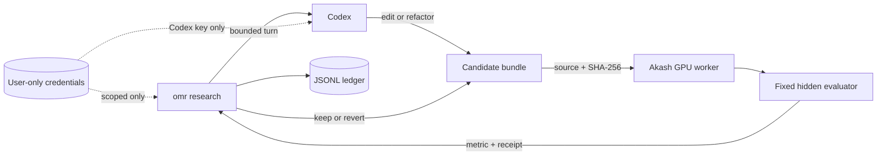

# One More Run

**Autoresearch on any compute.**

One More Run is a small control plane for bounded, autonomous ML research.
Codex rewrites a complete training program, an isolated Akash GPU worker
evaluates it against hidden fixed data, and One More Run keeps only measured
improvements.



The core does not know how a GPU is provisioned. An adapter emits a tiny JSONL
event protocol; the CLI enforces the run and time budgets, verifies that each
measurement matches its proposed candidate and evaluator, records durable
results, and renders the campaign.

## Run the code-evolution loop

Configure credentials without putting them in shell history or the repository:

```bash
uv sync
uv run omr setup
uv run omr doctor
```

`CODEX_API_KEY` is optional when the installed Codex CLI already has a saved
login. For unattended API-key operation, One More Run supplies the saved key
only to each bounded `codex exec` invocation. The Akash credential is used only
by the local deployment controller. Neither the Codex nor Akash credential
reaches the remote worker.

Then run one command:

```bash
uv run omr research research.md --yes
```

The first experiment measures the modular
[examples/code_candidate](examples/code_candidate) workspace. Before every
later experiment, bounded fresh Codex turns read the objective and measured
history, edit that workspace, and explicitly report when the candidate is ready
for expensive evaluation. The worker then evaluates the complete source bundle
against hidden deterministic data. Improvement advances the champion; a crash
or regression restores the previous bundle. The champion and history remain in
`.omr/autoresearch/`, while verified receipts remain in `experiments.jsonl`.

Codex may split modules and change feature construction, architecture, loss,
optimizer, schedule, and training algorithm. It cannot change the evaluator or
hidden validation targets.

## Three-minute demo

Run the campaign before recording so the demo does not depend on marketplace
startup time:

```bash
uv run omr research research.md \
  --max-runs 3 \
  --workspace .omr/demo \
  --ledger demo/experiments.jsonl \
  --yes
```

Then use the recording to show evidence rather than a spinner:

```bash
uv run omr doctor
find examples/code_candidate -type f -maxdepth 2
uv run omr status demo/experiments.jsonl
```

Suggested timing: 20 seconds for the problem and diagram, 30 seconds for the
modular candidate and readiness loop, 60 seconds for the real Akash ledger and
keep/revert decision, 30 seconds for credential and spend boundaries, and 40
seconds for the product close and one-command rerun.

## Try the numeric loop locally

Clone the submodule and run the deterministic adapter:

```bash
git clone --recurse-submodules https://github.com/drukpa1455/one-more-run.git
cd one-more-run
uv sync
uv run omr run research.md --plain -- uv run python examples/demo_adapter.py
uv run omr status experiments.jsonl
```

Remove `--plain` for the live terminal display. The demo adapter runs the same
adaptive coordinate search and fixed evaluator as the remote path, using a
deterministic CPU fallback when CUDA is unavailable. It exercises the real
propose, measure, observe, keep-or-reject loop without a deployment.

## Adapter protocol

Adapters write one JSON object per line to standard output and send human logs
to standard error:

```json
{"type":"campaign.started","provider":"akash"}
{"type":"experiment.started","run":1,"hypothesis":"baseline","candidate":{"learning_rate":0.02,"momentum":0.0,"steps":80},"evaluator":"smoke.linear-regression.v1"}
{"type":"experiment.progress","run":1,"metric":1.12}
{"type":"experiment.finished","run":1,"candidate_sha256":"12865576f004f19fb233e2b4abe1f35a491f63e4e55f39f5479408e772a195bb","evaluator":"smoke.linear-regression.v1","metric":1.04,"seconds":300,"cost_usd":0.17}
{"type":"campaign.finished"}
```

One More Run passes `OMR_RESEARCH`, `OMR_MAX_RUNS`, and `OMR_MAXIMIZE` to the
adapter. The CLI is the sole owner of the ledger. It normalizes and hashes the
candidate before the run, then requires the finished event to carry the same
hash and evaluator ID.
The ledger therefore preserves rejected candidates instead of retaining only a
score and description. The Akash adapter proposes one coordinate from the
current measured champion. An improvement advances the champion; a regression
reverses that coordinate before the search moves on. The authenticated evaluator
and workload stay fixed; only the bounded candidate crosses the boundary.

## Remember across campaigns

One More Run can optionally use [Hindsight](https://github.com/vectorize-io/hindsight)
as long-term memory. Start its local server, then set one variable to enable it:

```bash
docker run --rm -d --name hindsight -p 8888:8888 -p 9999:9999 \
  -e HINDSIGHT_API_LLM_API_KEY="$OPENAI_API_KEY" \
  -v hindsight-data:/home/hindsight/.pg0 \
  ghcr.io/vectorize-io/hindsight:latest
export OMR_HINDSIGHT_BANK=one-more-run
uv run omr run research.md --plain -- uv run python examples/demo_adapter.py
```

`HINDSIGHT_API_URL` defaults to `http://localhost:8888`; set
`HINDSIGHT_API_KEY` when the server requires a bearer token. Before a campaign,
the controller recalls relevant experience into `OMR_MEMORY` for the research
adapter. After each receipt is validated and durably appended to the ledger, it
retains the hypothesis, candidate, evaluator, metric, and decision under an
idempotent document ID. Memory calls are bounded and fail open, so unavailable
memory never consumes an experiment slot. Hindsight is a rebuildable index;
the JSONL ledger remains the source of truth. Use a new `--ledger` path for a
second campaign; the demo adapter prints the recalled experience to standard
error.

The `autoresearch` submodule is the reference workload. The included nonlinear
regression task is intentionally small enough for a hackathon demo; adapters for
that full workload and AcquaTerra can reuse the same edit/evaluate/keep contract.
The `pomerium` submodule pins the Apache-2.0 Pomerium source used by the
deployment.

## Run on Akash

The Akash worker is not public. A Pomerium Zero replica receives the deployment's
only public IP and proxies authorized requests to `http://worker:8080` over the
private Akash service network.

Create a standard Pomerium Zero cluster once, then configure:

1. A route from `https://worker.<cluster>.pomerium.app` to
   `http://worker:8080`.
2. A service account and a policy that allows its User ID on that route.
3. An API User token so the runner can point the cluster at each ephemeral Akash
   IP and restore the previous override during cleanup.

The route must use the cluster's starter domain so the runner can identify its
owner. Load all credentials from a secret manager:

```bash
export AKASH_API_KEY=...
export POMERIUM_ZERO_TOKEN=...
export POMERIUM_ZERO_API_TOKEN=...
export POMERIUM_ROUTE_URL=https://worker.<cluster>.pomerium.app
export POMERIUM_SERVICE_ACCOUNT_JWT=...
```

Then run:

```bash
uv run omr akash research.md --yes
```

By default, `omr akash` deposits `$0.50`, accepts only an open bid at or below
`1000 uact` per block, waits for a CUDA worker, runs three experiments, and
closes the deployment. Bidding, startup, and research share a ten-minute
deadline; cleanup calls are bounded to 30 seconds. The CLI generates
the worker token locally and injects it, together with the Zero cluster token,
only into the in-memory manifest sent to Akash. The Akash Console key, Pomerium
API User token, and Pomerium service-account JWT are never sent to the remote
worker. Pomerium consumes the service-account header while the worker verifies
its separate bearer token. Cleanup closes the deployment and restores the
cluster's previous override IP even when research fails.

`--yes` is the explicit authorization boundary for the displayed deposit, bid,
time limits, and temporary Pomerium route mutation. Never commit any credential.
Akash providers necessarily receive manifest environment variables, so rotate
the worker and Zero cluster tokens after a temporary test. Console API keys and
Pomerium API User tokens can mutate their respective accounts. See the
[Akash Managed Wallet API](https://akash.network/docs/api-documentation/console-api/getting-started/),
[Pomerium Zero API](https://www.pomerium.com/docs/internals/management-api-zero),
and [Pomerium service-account](https://www.pomerium.com/docs/capabilities/service-accounts)
documentation.

The worker supports both the original three-parameter smoke evaluator and the
code evaluator. Code experiments run one at a time in a child process with a
fixed hidden dataset, a hard timeout, a bounded source payload, and a scrubbed
environment that excludes controller credentials and the worker bearer token.
Every response binds the exact source hash to the evaluator identity. The SDL
accepts several trial-eligible NVIDIA models and providers that offer an IP
lease.

The worker and Pomerium images use immutable OCI digests. The Pomerium submodule
is pinned to v0.32.7, matching the deployed image source.

## Hackathon target

- Codex code evolution driven by previous measured results.
- Whole-program architecture, loss, optimizer, and training-loop experiments.
- Credential-separated Akash GPU evaluation with fixed hidden data.
- Pomerium Zero service identity in front of a private Akash GPU evaluator.
- Fixed evaluation and bounded runs, time, and spend.
- Live results with hypotheses, metrics, decisions, duration, and cost.
- A content-addressed winning candidate and replayable `experiments.jsonl`.

One More Prompt starts the idea. **One More Run tests it.**
