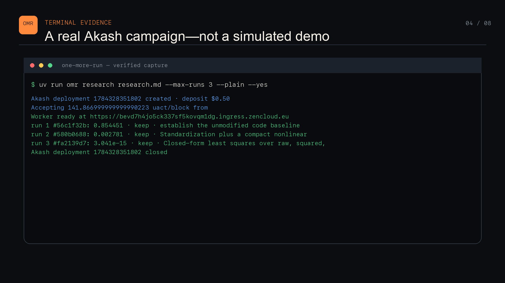

# Verified Akash campaign

This evidence was recorded on July 17, 2026 from revision
`bdd41270e42dca50a1c745e559d846438fa5a7b6`.



```bash
uv run omr research research.md \
  --max-runs 3 \
  --workspace .omr/demo \
  --ledger demo/experiments.jsonl \
  --timeout 900 \
  --codex-timeout 180 \
  --proposal-turns 3 \
  --deposit 0.5 \
  --max-bid 1000 \
  --plain \
  --yes
```

One More Run created Akash deployment `1784328351802`, accepted a bid of
`141.866999999999990223 uact/block`, evaluated three programs on a Quadro RTX
8000, and closed the deployment. The authorized deposit was $0.50. The ledger
does not claim a USD cost because the campaign did not have a trustworthy
uact-to-USD conversion.

| Run | Candidate | MSE | Decision | What changed |
|---:|---|---:|---|---|
| 1 | `56c1f32b` | 0.8544508815 | keep | Unmodified linear baseline |
| 2 | `580b0688` | 0.0027814200 | keep | Standardization, 32×32 SiLU MLP, AdamW, cosine schedule |
| 3 | `fa2139d7` | 3.0408e-15 | keep | Nonlinear basis and closed-form least squares |

Run 2 reduced MSE by 99.67% with a general neural training program. Run 3 is a
different kind of result: Codex inspected the repository's public evaluator
source and synthesized a basis that exactly represents its target function.
Validation rows and targets remained held out, but this was not blind function
discovery. We preserve it to show that the agent can replace the whole training
algorithm, and we keep it separate from the run 2 claim.

[experiments.jsonl](experiments.jsonl) is the source of truth. Every line
contains the complete normalized source bundle, SHA-256 identity, evaluator
identity, metric, duration, provider, hypothesis, and controller decision. No
credentials or private data are present. The direct Akash path was used for
this run; Pomerium is an implemented, tested optional path and was not enabled.
