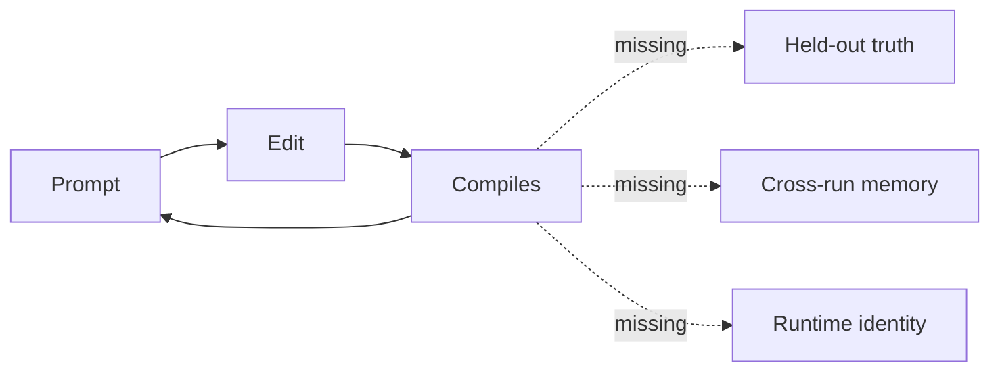
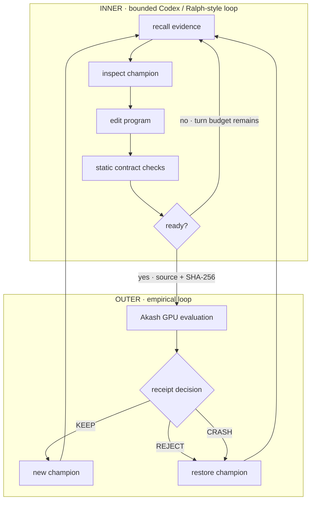
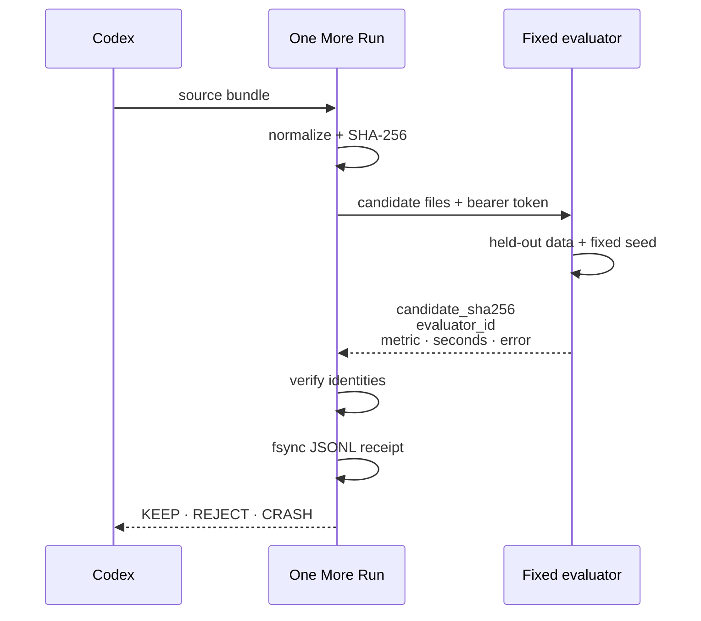
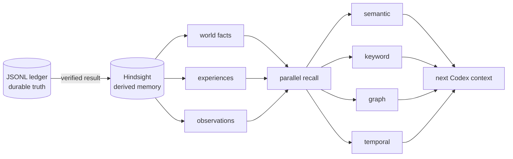
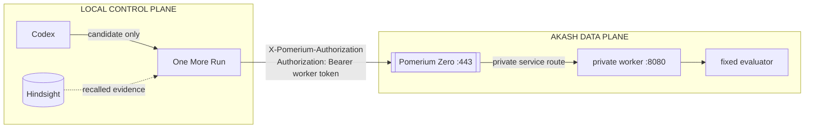

# LinkedIn carousel and judging deck

Build one eight-page composition, then export it twice:

- `one-more-run-carousel-opal.pdf`
- `one-more-run-carousel-garnet.pdf`

Each PDF uses one theme from cover through end card. The page structure and
copy remain identical.

## Format

- LinkedIn: 1080 × 1350 px, 4:5, PDF.
- Judging deck: adapt the same composition to 1920 × 1080, 16:9.
- Devpost gallery: crop selected pages to 1800 × 1200, 3:2.
- Safe area: 72 px on carousel; 96 px on deck.
- Type: Atkinson Hyperlegible Mono throughout.
- Maximum visible body copy: roughly 45 words per page, excluding node labels.
- Page number: `01/08` style, bottom-right, muted.

## Page 1 — The system

### Visible copy

```text
ONE MORE RUN

Autonomous ML research
with an empirical outer loop.

CODEX  ×  HINDSIGHT  ×  AKASH  ×  POMERIUM ZERO
```

### Visual

One horizontal causal line:

```text
EDIT  →  MEASURE  →  DECIDE  →  REMEMBER  ↺
```

Highlight `MEASURE`. No logos larger than the project name. No decorative AI
imagery.

### Speaker note

The product is a small control plane for autonomous ML research. The agent can
change a complete program, but only measured evidence advances it.

## Page 2 — The broken handoff

### Headline

```text
A plausible diff is not progress.
```

### Diagram



### Visible labels

```text
single loop
• grades its own work
• forgets failed hypotheses
• conflates code authority with compute authority
```

### Speaker note

Most demos optimize for task completion. Research needs a separate source of
truth, memory that survives the session, and an explicit authority boundary.

## Page 3 — Nested loops

### Headline

```text
Cheap reasoning inside expensive truth.
```

### Diagram



### Edge annotations

```text
INNER: 3 proposal turns · no GPU spend
OUTER: fixed runs · fixed timeout · explicit bid ceiling
```

### Speaker note

The inner loop may explore several coherent edits before declaring readiness.
The outer loop alone measures and updates the champion.

## Page 4 — The evidence contract

### Headline

```text
The metric is accepted only with its identity.
```

### Diagram



### Footer contract

```text
≤32 Python files · ≤256 KiB · one experiment at a time · hard timeout
```

### Speaker note

A metric without candidate and evaluator identity is not evidence. The ledger
retains rejected and crashed candidates, not only the winner.

## Page 5 — Memory earned by measurement

### Headline

```text
Memory begins after the receipt.
```

### Diagram



### Small graph inset

```text
objective ─PROPOSED→ hypothesis ─CREATED→ candidate:9b18e0a4
candidate ─MEASURED_BY→ evaluator:v1 ─RETURNED→ metric:0.019736
metric ─DECIDED→ KEEP ─ADVANCED→ champion
```

### Speaker note

The ledger remains canonical. Hindsight is a rebuildable graph-backed index
that retrieves relevant experience across campaigns and fails open.

## Page 6 — Identity before compute

### Headline

```text
The evaluator is private by default.
```

### Diagram



### Boundary labels

```text
Pomerium: service identity + route policy
Worker: application bearer auth
Controller: spend + lifecycle + receipts
```

### Speaker note

Pomerium is the only public service. It consumes its identity header before the
private worker separately verifies the application bearer token.

## Page 7 — The CLI

### Headline

```text
Every run leaves evidence.
```

### Visual

Use the exact output from:

```bash
uv run python docs/submission/carousel_cli.py --theme opal
uv run python docs/submission/carousel_cli.py --theme garnet
```

Capture the matching theme for each full deck. Keep the small line
“illustrative design mock” visible until replaced with a real run.

Crop around:

- recalled memory;
- inner-loop edit/readiness status;
- candidate hash;
- outer-loop metric and `KEEP`;
- evaluator identity; and
- retained evidence.

### Speaker note

The terminal is a live projection over the same JSONL protocol. It does not own
the result; it makes the evidence and budgets visible.

## Page 8 — The consequence

### Headline

```text
One loop improves the program.
The other improves the research process.
```

### Diagram

```text
program quality  ↑  measured by fixed evaluation
research quality ↑  improved by retained wins + failures
runtime trust    ↑  separated identity + application auth
operator control ↑ explicit run · time · spend budgets
```

### Closing copy

```text
One More Prompt starts the idea.
One More Run tests it.

github.com/drukpa1455/one-more-run
```

### Speaker note

The reusable primitive is not one model or dataset. It is the contract between
mutation, measurement, memory, identity, and cleanup.

## 16:9 adaptation

- Keep the same eight-page order and exact headlines.
- Move explanatory bullets into the right third; diagrams occupy the left two
  thirds.
- Use progressive reveals only for live presentation. PDF exports show the
  final state.
- Do not add a separate agenda, team, sponsor-logo, or thank-you slide. The
  eight-page causal story is the deck.
